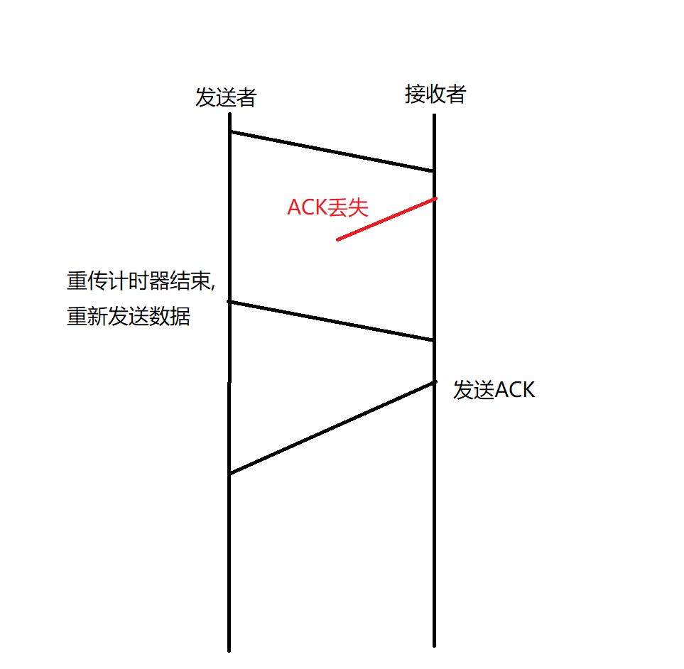
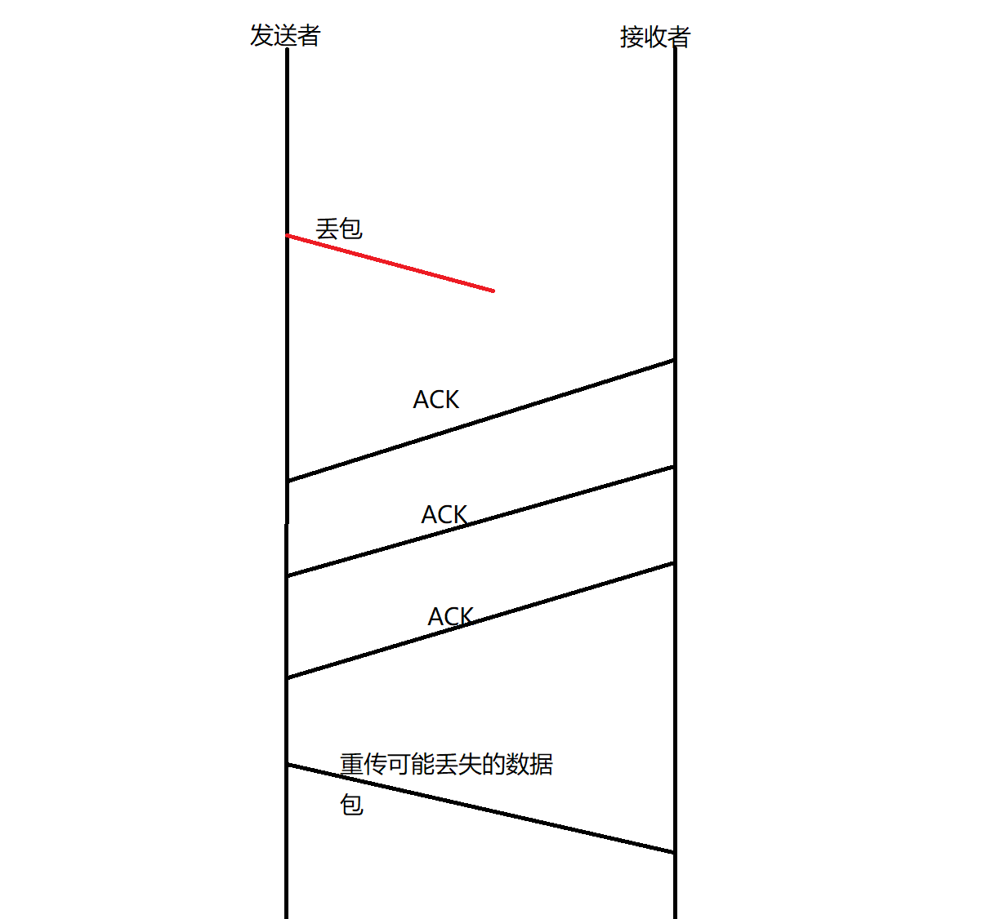
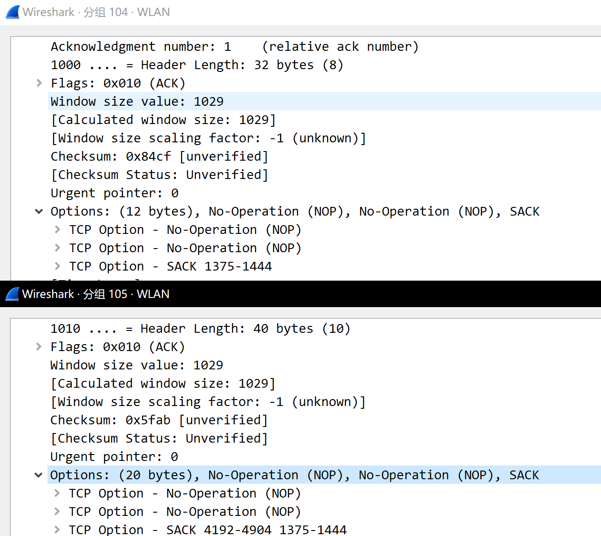

# TCP 协议中的超时重传以及SACK option

## 超时重传

### RTO

发送者发送数据包后, 启动重传定时器, 重传定时器到期时所花费的时间.

### RTT

一个数据包发送并确认所花费的时间.

### 关于计算RTO的算法

#### 经典算法

- 首先计算一个平滑的RTT来设置为SRTT, 然后设置一个常量 alpha(称为平滑因子, 通常取值0.8)

    > (alpha *SRTT) + (1 - alpha)*RTT ==> new SRTT

- 基于SRTT, 来计算出RTO

    > RTO = min[UBOUND, max[LBOUND, (beta * SRTT)]]

    > *UBOUND 通常取值 120s, LBOUND 通常取值1s, beta 通常取值1.3 - 2.0*

#### Jacobaon算法

- 第一次计算RTO :

    > RTT = R, RTTVAR = R/2, RTO = SRTT + max(G, K*RTTVAR)

    > *K 通常取值 4*

- 后续计算 :

    > RTTVAR = (1 - beta) *RTTVAR + beta* |SRTT(brfore) - R'|

    > SRTT = (1 - alpha) *SRTT + alpha* R'
    
    > RTO = SRTT + max(G, K * RTTVAR)

    > *T 和 T' 均为测量出的RTT, alpha 通常取值1/8, beta 通常取值1/4*

### 超时重传机制

#### 概念

 

 在发送者发送数据包之后, 会记录下报文段序列号并开始计时, 如果及时收到了该数据包的ACK, 则计时器会被取消掉, 否则会出发重传机制.

#### 重传二义性

数据包重传后, 发送者收到该数据包的ACK, 无法确认此ACK是第一次的还是第二次的ACK

#### Karn算法

为了避免重传二义性, Karn算法规定收到重传数据包的ACK, 不对此进行RTT测量.

### 快速重传机制

#### 概念

当接收者收到所期待的数据后续分组时, 表明当前期待的数据包可能丢失或者延迟到达, 因此可以返回dupthresh个ACK来决定发送者触发快速重传

#### 缺点

快速重传机制不能很好的解决重传哪些数据包的问题, 因为无法确定丢失了多少包, 发送者不知该重传超时的片段还是超时分段以及之后的所有包

### SACK 选项

SACK的全称是selective acknowledgment, 也就是选择性确认. 开启SACK选项后, 接收方会将自己收到什么包, 有没有失序片段告诉给发送者.

SACK选项一般占40字节, 其中kind占4字节, length占4字节, 剩下的则是4个SACK块

#### 接收端行为

当出现失序分段时, 接收端返回的ACK包中含有SACK选项, 其SACK选项中含有最新接收到的片段. 除了最新接收到的片段以外, 为了提高可靠性, 还会包含以前发送的SACK片段, 这些片段以新旧顺序依次在SACK中存放

#### 发送端行为

对于发送端来说, 除了记录累积ACK之外, 还要记录SACK信息, 以此来实现选择性重传. 

#### 一个简单的SACK示例讲解

发送者依次发送

    - 1-3
    - 5-7
    - 9-10
    - 4-5
    - 7-8
 
 这几个分段(假设发送者接收SACK后, 并不重传数据, 而是以既定顺序发包)

那么接收者就会返回

    - ACK3
    - ACK3 + SACK 5-7
    - ACK3 + SACK 9-10, 5-7
    - ACK7 + SACK 9-10
    - ACK10

#### SACK的拓展(DSACK)

当接收者收到重复的分段时, 它可以将其分段加入到SACK选项中. 发送者收到此ACK后, 发现累积ACK值大于SACK选项值, 此时就可得知自己发送了重复的分段, 要实现DSACK, 只要允许SACK的值小于累积ACK值即可.

