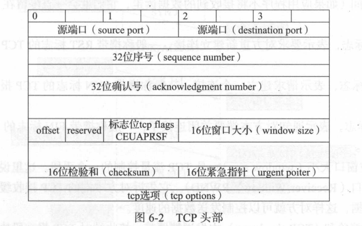

# 后台开发笔记


## 说明

这是关于 后台开发-核心技术与应用实践 的读书笔记, 笔记内存分布和书中章节的安排一致

## C++编程常用技术

### 函数模板

函数模板,实际上建立一个通用函数. 函数类型和形参不具体制定, 而用``一个虚拟的类型``代表. 这个通用函数就是函数模板

定义函数模板的一般格式:

```C++
template<typename T>
```

举例:

```C++
#include<iostream>
using namespace std; template<typename T>
T min(T a,T b,T c){    
    if(a>b) a=b; 
    if(a>c) a=c;

    return a;
}
int main() {
    int a=l , b=2,c=3;
    cout<<min(a,b,c)<<endl;
    long long al=l000000000,bl=2000000000,cl=3000000000;
    cout<<min(al, bl, cl )<<endl;

    return O;
}
```

### do{}while(0) 的用处

```C++
#define fun1(x) {\
    statement1;\
    statement2;\
}

#define fun2(x) {\
    do {\
        statement1;\
        statement2;\
    }while(0)\
}

int main(void) {
    if(cond == 0)
        fun1(param);    // right
    else if(cond == 1) 
        fun2(param);    // wrong
    else 
        statement;

    return 0;
}

```

通过以上代码, 我们可以得知 do{}while(0) 可以防止宏定义函数产生的问题

### 条件编译+extern "C"

```C++
#ifdef _cplusplus
    extern "C" {
        // 如果定义了_cplusplus 则要加extern "C" 使得代码以C语言的语法进行编译
    }
#endif
```

## 面向对象的C++

### 静态成员方法

两种写法:``Class fun();`` 和 ``obj.fun();``

### 空类所占的大小为1byte

### 模板类
```C++
template <class T>
class Test {
    private:
        T x, y;
    public:
        Test(T a, T b) : x(a), y(b) {}
}

int main(void) {
    Test <int> i(1, 2);
    return 0;
}
```

### 单例模式

通过一个静态指针来保存唯一的对象实例, 并返回实例地址. 注意: ``构造方法必须为private``

## 常用STL的使用

### vector
#### 遍历vector
```C++
vector<int> vec = sourceVec;
vector<int> ::iterator iter;
for(iter = vec; iter != vec.end(); iter++) {
    // do something   
}
```

#### 增删元素
```C++
/* 添加 */
vec.push_back(item);
vec.insert(iter);
/* 删除 */
vec.pop_back();
vec.erase(iter);// 注意返回值是被删元素下一个元素
```
#### 缩小空间
```C++
// vector<int>().swap<vec>;
// vec.swap(vector<int>());
void clearVector(vector<T>)
```

### map
#### 增删元素

```C++
/*添加*/
MAP.insert(pair<int, string>(0, "test"));// insert() 若存在, 会覆盖
MAP.insert(map<int,  string>::value_type (0, "test"));
MAP[0] = "test";// 若存在, 会覆盖

/*删除*/
map.erase(key);
map.earse(iter);
map.earse(iter, e);

```

#### 遍历map
总共有三种遍历方式
第一种:前向迭代器迭代
```C++
map<int, string>::iterator iter;
for(iter = MAP.begin(); iter != MAP.end(); iter++) {
    // do something
}
```
第二种:反向迭代器迭代

注: rbegin() 指向最后, 这种迭代方式是从后向前

```C++
map<int , string>::reverse_iterator riter;
for(riter = MAP.rbegin(); riter != MAP.rend(); riter++) {
    // do something
}
```

第三种:数组方式
```C++
for(int i = 0;  i < MAP.size(); i++) {
    MAP[i]; // do something
}
```

#### 查找

find定位数组出现位置, 返回一个迭代器, 数据出现, 返回所在位置的迭代器, 若无数据, 则返回end()

## 编译
MoYu.
摸鱼.
## 调试
MoYu.
摸鱼.
## TCP协议
### 网络模型
#### 七层网络模型
- 应用层 
- 表示层
- 会话层
- 传输层
- 网络层
- 数据链路层

除了``数据链路层``之外, 其他每层都会给上层的数据加抱头(数据链路层还加报尾). 

#### 四层网络模型

使用最为广泛的TCP/IP分层模型

- 应用层    DNS/FTP/HTTP/SMTP...
- 传输层    TCP/IP
- 网间层    TCMP/IP
- 网络接口  ARP/RARP

##### 网络接口层

网络接口层包括用于协作IP数据在已有网络介质上传输的协议. 它提供了TCP/IP协议的数据结构和实际物理硬件之间的链接
##### 网间层
网间层对应OSI七层参考模型的网络层, 包含IP协议 RIP协议(路由信息协议), 负责数据的包装, 寻址和路由. 同时还包含ICMP(网间控制报文协议)用于提供网络诊断信息.
##### 传输层
传输层对应OSI七层参考模型的传输层, 它提供两种端对端的通信服务. ``TCP协议``提供可靠的数据流传输服务, ``UDP协议``提供不可靠的用户数据报服务.
##### 应用层
应用层对于OSI七层参考模型的应用层和表示层, 包含Finger Whois FTP HTTP等.

### TCP头部


- **32(16 * 2)位端口号**

 告知主机该报文来自哪儿(源端口)以及传输给哪个上层协议或应用程序(目的端口)的. 次序为: 源端口, 目的端口. 端口的数量为: 65535 - 1(2^16 - 1).
- **32位序列号**

一次TCP通信, 某个传输方向上的字节流的每个字节的编号. 假设A 和 B 进行TCP通信, A 发送给B 的第一个TCP报文段中, 序号值被系统初始化为某个随机的值ISN(Initial Squence Number). 那么在该传输方向上, 后续的TCP报文段中的序号值将被系统设置为IS+报文段携带数据的第一个字节在整个字节流的偏移.

> 比如一个TCP报文段的数据是字节流的1025-2048, 则它的32位序列号位ISN + 1025

- **32位确认号**

用作对另一方发送来的TCP报文段的相应, 其值是收到的TCP报文段的序号值+1. 

- **4位头部长度**

标志该TCP头部有多少个32bit. TCP头部最长为60Byte.

- **6位标识位**

    - ``URG`` 表示紧急指针是否有效
    - ``ACK`` 表示确认号是否有效, 一般成携带ACK标志的TCP报文段位"确认报文段"
    - ``PSH`` 提示接收端应用程序应该立即从TCP接受缓冲区中独奏数据, 为接受后续数据腾出空间. 
    - ``RST`` 表示要求对方重新建立连接, 一般称携带RST标志的TCP报文段为"复位报文段"
    - ``SYN`` 表示请求建立一个连接, 一般成携带SYN标志的TCP报文段位"同步报文段"
    - ``FIN`` 表示通知对方本段要关闭连接了, 一般称携带FIN标志的TCP报文段为"结束报文段"

- **16位窗口大小**

是TCP流量控制的一个手段, 这里的窗口, 指的是接受通告窗口(Receiver Window). 他告诉对方本端的TCP接受缓冲区还能容纳多少字节的数据, 以此来使对方控制发送数据的速度

- **16位校验和**

由发送端来填充, 接收端对TCP报文段进行CRC算法以校验TCP报文段在传输过程中是否损坏. 注意, 这个校验不仅包括TCP头部, 还包括数据部分.

- **16位紧急指针**

一个正的偏移量, 他和序号字段的值相加表示最后一个紧急数据的下亿字节的序号.

### TCP状态流转

#### 三次握手四次挥手


**``建立连接``**

- 第一次握手

建立连接的时候, 客户端发送``SYN包(SYN = J)``到服务器, 并进入``SYN_SEND``状态, 等待服务器确认.

- 第二次握手

服务器收到SYN包, 必须确认客户的SYN(ACK = J + 1), 同时自己也发送一个SYN包(SYN = K), 即``SYN + ACK``包, 此时服务器进入``SYN_RECV``状态.

- 第三次握手

客户端收到服务器的SYN+ACK包, 向服务器发送确认包ACK(ACK = K + 1), 此包发送完毕, 客户端和服务器都进入``ESTABLISHED``状态, 完成三次握手.

**``四次挥手``**

TCP有一个概念叫做``半关闭``, 因为TCP的连接是全双工(同时发送和接受)的,因此在关闭连接的时候, 必须关闭**传**和**送**两个方向的连接. 客户机给服务器一个FIN的TCP报文, 然后服务器返回客户端一个ACK报文, 并且发送一个FIN报文, 当客户机回复ACK报文后, 连接就结束了. 

#### TCP状态流转图


- CLOSED

表示初始状态

- LISTEN 

表示服务器端的某个socket处于监听状态, 可以接受连接

- SYS_SENT

在服务端监听后, 客户端socket执行CONNECT连接时, 客户端发送SYN报文, 此时的客户端就进入了SYN_SENT状态, 等待服务端确认

- SYN_RCVD

服务端接收到了SYN报文, 在正常情况下,这是服务器端建立TCP连接时的一个中间状态, 等收到客户端的ACK报文后, 他就会进入ESTABLISHED状态

- ESTABLISHED

连接建立, 双方可以进行通信.

- FIN_WAIT_1

建立连接之后, 一方请求终止连接, 等待对方的FIN报文. FIN_WAIT_1状态是当socket在ESTABLISHED时, 他想主动关闭连接, 向对方发送FIN, 此时进入FIN_WAIT_1状态, 该状态一般较难见到, 因为对方无论在何种情况下, 都应该马上回应ACK报文, 收到ACK报文之后, 进入FIN_WAIT_2.

- FIN_WAIT_2

FIN_WAIT_2下的socket表示半连接, 即有一方要求关闭连接,但另外还告诉对方, 我暂时还有一些数据需要传送给你, 请稍后再关闭连接.

- TIME_WAIT

表示收到了对方的FIN报文, 并发送了ACK报文, 等待2MSL之后即可回到CLOSED状态了. 但是如果再FIN_WAIT_1状态下, 收到了对方同时带FIN+ACK标志的报文时, 可以直接进入TIME_WAIT状态, 无需经过FIN_WAIT_2

- CLOSING

正常情况下, 发送报文后, 应该先收到对方的ACK, 再收到对方的FIN报文. 但是CLOSING表示自己发送了FIN报文后,收到了对方的FIN报文.双方同时关闭socket, 就会出现该问题.

- CLOSE_WAIT

等待关闭, 当对方关闭一个socket后发送FIN报文给自己, 系统会回应一个ACK报文给对方, 此时进入CLOSE_WAIT状态, 此时应该考虑是否还有数据发送给对方, 如果没有, 则回复FIN给对方

- LAST_ACK

当收到FIN后, 进行ACK 和 FIN发送后, 等待对方ACK的状态

- CLOSED 

当前LAST_ACK状态, 收到ACK报文后, 也可以进入到CLOSED可用状态

## Internet 协议

### IP协议简介

IP协议提供了一种尽力而为, 无连接的数据包交付服务. ``尽力而为``指的是不保证IP数据包能成功到达目的地. ``无连接``意味着IP协议不维护网络单元(即路由器)中数据报相关的任何连接状态信息, 即连续发送的两个数据包可不按顺序交付.

### IPv4头部字段


- 版本

    IPv4和IPv6的第一个字段都一样, IPv4为4, IPv6为6.

- IHL

    Internet head length, 保存着IPv4头部的32位字的数量. 由于它是4位的字段, 所以IPv4最多保存60个字节. 正常值为5.

- Tos

    前6位为`区分服务`字段, 后两位是`显示拥塞通知字段/指示位`

- 总长度字段

    总长度字段是IPv4数据包的长度. 通过此字段和IHL字段我们可以知道数据包的数据部分从哪里开始, 以及它的长度. 因为它是16位, 所以IPv4数据报的最大长度(包含头部)为65535字节, 但一般不会这么长.

- 标识

    帮助标识由IPv4主机发送的数据报, 为了避免将一个数据报分片和其他数据报分片混淆, 发送主机每次发送数据报时都将内部计数器+1, 并将该计数器值复制到IPv4标识字段里.

- 标志 & 分片
    
    稍后介绍

- TTL
    Time to live (跳数限制), 一个数据报可经过的路由器数量的上限, 为了防止路由环路而导致的数据报在网络中永远循环.

- 协议字段

    该字段包含一个数字, 表示数据报有效载荷部分的数据类型, 最常用的是17(UDP)和6(TCP).

- 头部校验和字段

    该字段仅计算IPv4的头部, 并不检查数据报有效载荷的正确性.

### DS字段

    区分服务（DS）字段又叫差分服务字段，标识了不同类型的服务（不只是尽力而为的服务）。区分服务（DiffServ）是一个框架和一组标准。IP数据报以某种方式（通过预定义模式设置某些位）被标记，使它们的转发不同于其他数据报，这体现在优先级和服务类型上。这样做可能导致网络中排队延时的增加或减少，以及出现其他特殊效果。DS字段中的数字称为区分服务代码点（DSCP），“代码点”指的是预定义的具有特定含义的位。

### IPv6头部字段


- 有些部分略过

- 20位，IPv6新增
    
    字段，标记需要IPv6路由器特殊处理的数据流. 该字段用于某些对连接的服务质量有特殊要求的通信，诸如音频 或视频等实时数据传输. 在IPv6中，同一信源和信宿之间可以有多种不同的数据流，彼此之间以非“0”流标记区分. 如果不要求路由器做特殊处理，则该字段值置为“0”.

- 下一个头部

    

