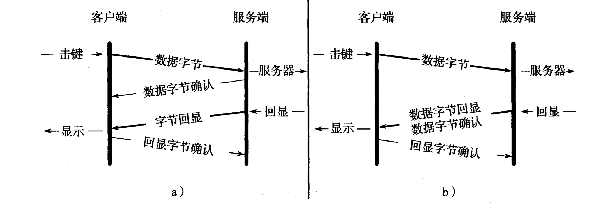
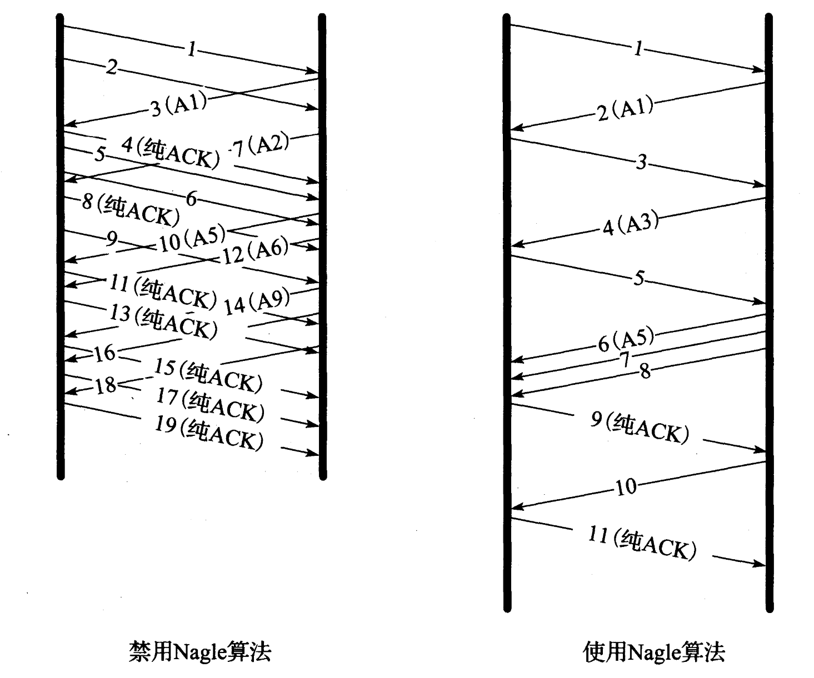
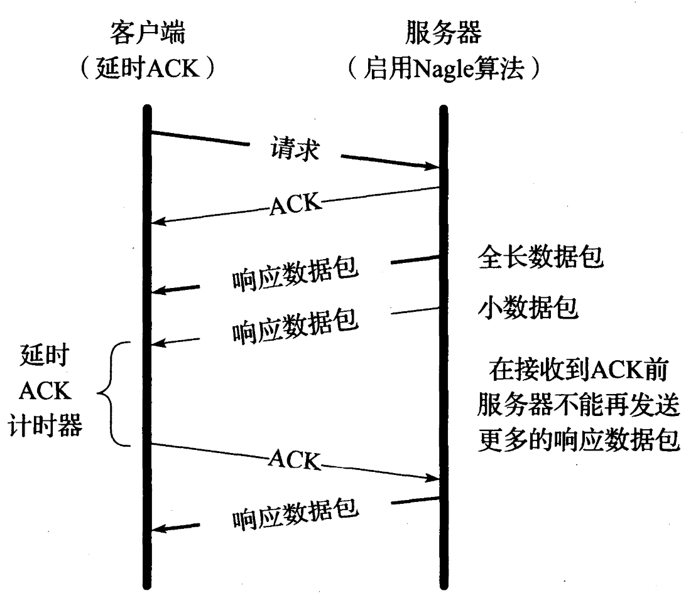
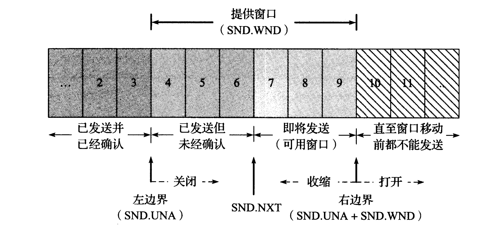

## 交互式通信

在网络传输中, 有些数据包中的内容很多, 甚至和MSS的大小相同, 而有些数据包中的内容仅仅只有一字节. 所以数据包大小差异巨大. 若是数据过小的包太过于多的话, 就会造成网络利用率不高, 原因是要花费许多字节来构成TCP等协议头部.

在ssh中, 当我们敲下一个字符, 客户端获取输入信号, 马上就会传输给ssh服务器. 这也是网络质量优良时, 我们使用ssh几乎无延迟的原因了. 一个键的输入, TCP协议层面上, 到底都发生了什么?

由图我们可以看见, b里的服务端将ACK和字节回显放在同一个数据包里发送给客户端. 这种TCP典型的实现方式被称为延时ACK方法. 在这种交互式通信中, 我们常常采用Nagle算法.

## Nagle算法

#### 提出原因

对于局域网来说,数据过小的微型报(tinygram)并不会造成相当高的网络传输代价, 而在广域网中, 这些微型报会加重阻塞, 严重影响网络性能. 

#### 描述

通常来讲, 当TCP连接中有在传数据, 则小于MSS的数据包均不能发送. 

[1] 在传数据即是已发送但仍未收到ACK的数据包. 

[2] 有几种情况下, 小于MSS的数据包也可被发送

 - 当数据包中含有FIN
 - 设置了TCP_NODELAY
 - 超时的包一般都可发送

下图描述了Nagle算法停-等特性

#### Nagle算法和延时ACK的反应

当服务器发送给客户端一个MSS长度的数据包和一个微型报时, 此时Nagle算法规定其并不能再发送数据包, 而客户端一端则希望能得到更多的数据包,  然后延迟发送ACK. 此时就会发生暂时性的死锁. 当延迟ACK计时器结束之后, 会解除死锁.

#### 禁用Nagle算法

可以设置TCP_NODELAY来禁用Nagle

## 流量控制与窗口管理

在TCP协议中, 我们可以采用滑动窗口来实现流量控制. 当数据发送到一端, 处理器就会排队处理这些数据,然而一直不确认数据包的话, 接收方会让发送方停止发送数据, 原因是可用窗口为零.

#### 滑动窗口

只有收到和窗口左边界相同的序列号时, 数据才会接受并且窗口左移. 但是带有SACK的TCP连接, 可以接受和左边界不同的序列号数据, 但是窗口并不会左移.

#### 零窗口和TCP持续计时器

当接收窗口为0时, 可以有效阻止发送端继续发包. 当接收窗口重新可用时, 接收端会发送一个窗口更新的数据包.这样的数据包一般不带有数据(纯ACK).

当这个窗口更新包丢失的话, 就会陷入死锁. 因此发送端采用一个``持续计时器``间歇的查询接收端, 看其窗口是否有增长, 其以指数时间间隔发送.

#### 糊涂窗口综合征

发送端应用进程产生数据很慢、或接收端应用进程处理接收缓冲区数据很慢，或二者兼而有之;会使应用进程间传送的报文段很小,特别是有效载荷很小. 极端情况下,有效载荷可能只有1个字节, 这种现象就叫糊涂窗口综合症。

- 接收端

接收端不应给发送端通告一个太小的窗口值, 当窗口小于MSS长度或者1/2的缓冲空间时, 告知给发送端一个0的窗口值.

- 发送端

发送端不应发送过小的数据段, 而是由Nagle算法决定何时发送, 发送需要满足以下条件

    - 全长为MSS的报文段
    - 长度大于等于接收端告知的最大窗口值的1/2
    - 某一个ACK不是当前期盼的(未经确认的在传数据)
    - 连接禁用Nagle算法

